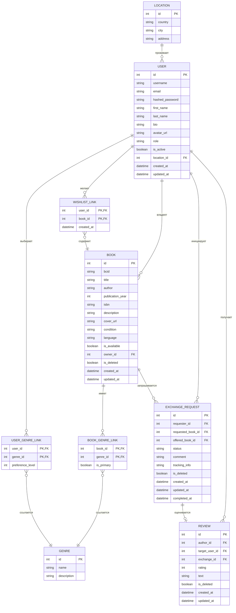

# Отчет по лабораторной работе №1: "Реализация серверного приложения на FastAPI"

**Дисциплина:** Web-программирование

**Тема проекта:** Веб-приложение для буккроссинга (Bookcrossing)

**Студент:** Христофоров Владислав Николаевич, WEB 2.1

## 1. Введение и бизнес-логика проекта

Данный документ представляет собой технический отчет и сопроводительную документацию к асинхронному серверному приложению (API) для платформы обмена книгами — буккроссинга. Система спроектирована с целью предоставить пользователям удобный и безопасный инструмент для учета личных библиотек, поиска книг по географическому признаку и жанрам, а также для автоматизированного проведения сделок обмена.

### Бизнес-логика системы включает следующие аспекты:

- **Идентификация физических книг:** Каждая книга привязывается к уникальному коду буккроссинга (BCID), что позволяет отслеживать конкретный перемещающийся экземпляр, а не абстрактное издание.
- **Справочники:** Города (локации) и жанры представляют собой глобальные справочники, ведение которых доверено исключительно администраторам для предотвращения дублирования данных.
- **Система заявок на обмен:** Заявка связывает отправителя, запрашиваемую книгу и опционально предлагаемую взамен книгу. Принятие заявки (статус ACCEPTED) временно блокирует доступность обеих книг для других участников, а успешное завершение сделки (COMPLETED) автоматически переписывает владельца книги в системе.
- **Безопасность и ролевой доступ (RBAC):** Пользователи делятся на обычных (user) и администраторов (admin). Обычные пользователи могут управлять только собственным контентом (своими книгами, вишлистом, профилем). Администраторы обладают привилегиями обхода ограничений (могут изменять любые профили, книги, обмены и справочники).
- **Мягкое удаление (Soft Delete):** Удаление пользователей, книг, отзывов и заявок не приводит к каскадному разрушению связей в БД. Сущности помечаются флагом is_deleted (или is_active=False), скрываясь из выдачи каталога, но сохраняя целостность истории обменов.

### 1.1 Ссылки на артефакты разработки

Разработка проекта велась итеративно в системе контроля версий Git. Ниже представлены ссылки на ключевые вехи реализации:

| Этап разработки             | Описание                                                           | Ссылка на репозиторий / коммит                                                                                                                     |
| :-------------------------- | :----------------------------------------------------------------- | :------------------------------------------------------------------------------------------------------------------------------------------------- |
| **Основной репозиторий**    | Исходный код всей серверной части                                  | [GitHub Repository](https://github.com/NovemberMoon/ITMO_ICT_WebDevelopment_tools_2025-2026/tree/lab-1)                                            |
| **Практическая работа 1.1** | Разработка Pydantic-моделей и временного API в оперативной памяти  | [Коммит Практики 1.1](https://github.com/NovemberMoon/ITMO_ICT_WebDevelopment_tools_2025-2026/commit/482a9b08c98ece34f0b6b4c0c792cd05abceed7e)     |
| **Практическая работа 1.2** | Интеграция SQLModel, описание реляционных связей M:M               | [Коммит Практики 1.2](https://github.com/NovemberMoon/ITMO_ICT_WebDevelopment_tools_2025-2026/commit/4e78fc55d78ffeb6e3d70f9fb45c218a13e6dcbd)     |
| **Практическая работа 1.3** | Интеграция Alembic, версионирование схемы БД и чтение конфигураций | [Коммит Практики 1.3](https://github.com/NovemberMoon/ITMO_ICT_WebDevelopment_tools_2025-2026/commit/08b4837fc23d999b582791aa329c18861b43d924)     |
| **Финальная версия**        | Реализация JWT, замков безопасности (RBAC) и смены паролей         | [Коммит Финальной версии](https://github.com/NovemberMoon/ITMO_ICT_WebDevelopment_tools_2025-2026/commit/871f0da738ae862588e05576d70b939f1235a19c) |

## 2. Архитектура и стек технологий

Программное решение спроектировано по модульному принципу, разделяя доменные модели, логику подключения к базе данных, сквозную безопасность и конечные точки API. Все ключевые операции работы с СУБД выполняются в асинхронном режиме.

| Компонент         | Технология                               | Роль и назначение в архитектуре                                                                          |
| :---------------- | :--------------------------------------- | :------------------------------------------------------------------------------------------------------- |
| **Web-Фреймворк** | FastAPI (v0.136.1)                       | Асинхронная обработка HTTP-запросов, валидация входящих структур данных, генерация OpenAPI спецификации. |
| **СУБД**          | PostgreSQL + asyncpg                     | Асинхронное хранение реляционных структурированных данных приложения.                                    |
| **ORM / Схемы**   | SQLModel (v0.0.38) + SQLAlchemy Async    | Декларативное описание таблиц и выполнение неблокирующих асинхронных запросов в БД.                      |
| **Миграции**      | Alembic (v1.18.4)                        | Автоматическая генерация и накат изменений структуры БД.                                                 |
| **Безопасность**  | passlib (bcrypt v3.2.2), PyJWT (v2.12.1) | Хеширование паролей пользователей (алгоритм bcrypt), выпуск и валидация JWT токенов доступа.             |

## 3. Схема базы данных (ER-диаграмма)

Реляционная модель состоит из 9 таблиц. На диаграмме отражены связи между сущностями, включая промежуточные таблицы связей «многие-ко-многим» (M:M):



## 4. Спецификация программного интерфейса (API)

Все реализованные 44 эндпоинта (за исключением корневого эндпоинта /) разделены на специализированные контроллеры (роутеры) со строгим разграничением прав доступа.

### 4.1 Аутентификация и пользователи (/auth, /users)

| Метод  | Эндпоинт                       | Назначение операции                                          | Доступ           |
| :----- | :----------------------------- | :----------------------------------------------------------- | :--------------- |
| POST   | /auth/register                 | Регистрация нового аккаунта (пароль хешируется)              | Анонимно         |
| POST   | /auth/login                    | Аутентификация пользователя (выдача Bearer JWT-токена)       | Анонимно         |
| GET    | /users/me                      | Получение профиля текущего авторизованного пользователя      | Авторизованный   |
| GET    | /users/                        | Получение списка всех активных (не забаненных) пользователей | Анонимно         |
| GET    | /users/{id}                    | Получение подробного профиля пользователя с его локацией     | Анонимно         |
| PATCH  | /users/{id}                    | Частичное обновление данных профиля                          | Владелец / Админ |
| DELETE | /users/{id}                    | Бан/удаление пользователя (установка is_active=False)        | Админ            |
| POST   | /users/{id}/password           | Смена пароля с обязательной сверкой старого пароля           | Владелец / Admin |
| GET    | /users/{id}/wishlist           | Просмотр списка избранных книг (вишлиста) пользователя       | Анонимно         |
| POST   | /users/{id}/wishlist/{book_id} | Добавление книги в вишлист пользователя                      | Владелец / Админ |
| DELETE | /users/{id}/wishlist/{book_id} | Удаление книги из вишлиста                                   | Владелец / Админ |
| GET    | /users/{id}/genres             | Просмотр читательских интересов (жанров) пользователя        | Анонимно         |
| POST   | /users/{id}/genres/{genre_id}  | Добавление жанра в список интересов пользователя             | Владелец / Админ |
| DELETE | /users/{id}/genres/{genre_id}  | Удаление жанра из интересов                                  | Владелец / Админ |
| GET    | /users/{id}/books              | Просмотр списка всех книг конкретного пользователя           | Анонимно         |
| GET    | /users/{id}/exchanges          | История поданных и полученных пользователем обменов          | Анонимно         |
| GET    | /users/{id}/reviews            | Просмотр всех отзывов, оставленных о пользователе            | Анонимно         |

### 4.2 Каталог книг и управление жанрами (/books, /genres)

| Метод  | Эндпоинт                      | Назначение операции                                              | Доступ           |
| :----- | :---------------------------- | :--------------------------------------------------------------- | :--------------- |
| GET    | /books/                       | Список книг с фильтрами по доступности, поиску, жанру и городу   | Анонимно         |
| GET    | /books/{id}                   | Детальная информация о книге по ее ID                            | Анонимно         |
| GET    | /books/bcid/{bcid}            | Поиск книги по уникальному коду буккроссинга (BCID)              | Анонимно         |
| POST   | /books/                       | Регистрация книги в системе (владельцем становится текущий юзер) | Авторизованный   |
| PATCH  | /books/{id}                   | Обновление информации о книге                                    | Владелец / Админ |
| DELETE | /books/{id}                   | Мягкое удаление книги из каталога (is_deleted=True)              | Владелец / Admin |
| POST   | /books/{id}/genres/{genre_id} | Связывание книги с определенным жанром (M:M)                     | Владелец / Админ |
| GET    | /genres/                      | Получение справочника всех доступных жанров                      | Анонимно         |
| GET    | /genres/{genre_id}            | Детальный просмотр жанра по ID                                   | Анонимно         |
| POST   | /genres/                      | Создание новой жанровой категории                                | Админ            |
| PATCH  | /genres/{genre_id}            | Обновление информации о жанре                                    | Админ            |
| DELETE | /genres/{genre_id}            | Удаление жанра из справочника                                    | Админ            |

### 4.3 Справочник локаций (/locations)

| Метод  | Эндпоинт                 | Назначение операции                                   | Доступ   |
| :----- | :----------------------- | :---------------------------------------------------- | :------- |
| GET    | /locations/              | Получение списка всех доступных локаций               | Анонимно |
| GET    | /locations/{location_id} | Получение информации о локации по ID                  | Анонимно |
| POST   | /locations/              | Добавление новой локации (города/страны) в справочник | Админ    |
| PATCH  | /locations/{location_id} | Обновление данных локации                             | Админ    |
| DELETE | /locations/{location_id} | Удаление локации из справочника                       | Админ    |

### 4.4 Заявки на обмен и отзывы (/exchanges, /reviews)

| Метод  | Эндпоинт             | Назначение операции                                                            | Доступ                  |
| :----- | :------------------- | :----------------------------------------------------------------------------- | :---------------------- |
| POST   | /exchanges/          | Инициация заявки на обмен. Инициатор берется из токена                         | Авторизованный          |
| GET    | /exchanges/          | Получение списка активных заявок на обмен в системе                            | Анонимно                |
| GET    | /exchanges/{id}      | Детальный просмотр заявки на обмен по ID                                       | Анонимно                |
| PATCH  | /exchanges/{id}      | Обработка заявки (Одобрение ACCEPTED / Отмена REJECTED / Завершение COMPLETED) | Участник сделки / Админ |
| DELETE | /exchanges/{id}      | Отмена/архивация заявки с освобождением забронированных книг                   | Инициатор / Админ       |
| POST   | /reviews/            | Оставить отзыв о завершенном обмене (с валидацией участия)                     | Участник сделки         |
| GET    | /reviews/            | Просмотр всех неудаленных отзывов                                              | Анонимно                |
| GET    | /reviews/{review_id} | Получение конкретного отзыва по ID                                             | Анонимно                |
| PATCH  | /reviews/{review_id} | Редактирование текста или оценки отзыва                                        | Автор отзыва            |
| DELETE | /reviews/{review_id} | Мягкое удаление отзыва (is_deleted=True)                                       | Автор отзыва            |

### 4.5 Общие эндпоинты

| Метод | Эндпоинт | Назначение операции                                    | Доступ   |
| :---- | :------- | :----------------------------------------------------- | :------- |
| GET   | /        | Вывод приветственного сообщения и ссылки на Swagger UI | Анонимно |

## 5. Исходный код конфигурации и подключения к базе данных

Ниже представлены финальные исходные файлы, реализующие конфигурационные параметры и инициализацию сессии базы данных.

### 5.1 Конфигурация (src/config.py)

```python
import os

class Settings:
    # База данных
    DATABASE_URL: str = os.getenv("DB_URL", "sqlite:///./bookcrossing.db")

    # Безопасность и JWT
    SECRET_KEY: str = os.getenv("SECRET_KEY", "super-secret-key-for-bookcrossing-lab1")
    ALGORITHM: str = os.getenv("ALGORITHM", "HS256")
    ACCESS_TOKEN_EXPIRE_MINUTES: int = int(os.getenv("ACCESS_TOKEN_EXPIRE_MINUTES", "30"))

# Создаем глобальный объект настроек
settings = Settings()
```

### 5.2 Подключение к базе данных (src/database.py)

```python
from typing import AsyncGenerator
from sqlmodel.ext.asyncio.session import AsyncSession
from sqlalchemy.ext.asyncio import create_async_engine, async_sessionmaker
from config import settings

engine = create_async_engine(settings.DATABASE_URL, echo=True)

async_session_factory = async_sessionmaker(
    engine, expire_on_commit=False
)

async def get_session() -> AsyncGenerator[AsyncSession, None]:
    async with async_session_factory() as session:
        yield session
```

## 6. Финальные модели данных (SQLModel)

Описание схем и таблиц базы данных разделено на изолированные доменные модули.

### 6.1 Промежуточные связи Many-to-Many (src/models/links.py)

```python
from typing import Optional
from datetime import datetime
from sqlmodel import SQLModel, Field

# Связь Пользователь - Жанр
class UserGenreLink(SQLModel, table=True):
    __tablename__ = "user_genre"
    user_id: Optional[int] = Field(default=None, foreign_key="user.id", primary_key=True)
    genre_id: Optional[int] = Field(default=None, foreign_key="genre.id", primary_key=True)
    preference_level: int = Field(default=5, description="Уровень интереса от 1 до 5")

# Связь Книга - Жанр
class BookGenreLink(SQLModel, table=True):
    __tablename__ = "book_genre"
    book_id: Optional[int] = Field(default=None, foreign_key="book.id", primary_key=True)
    genre_id: Optional[int] = Field(default=None, foreign_key="genre.id", primary_key=True)
    is_primary: bool = Field(default=False, description="Основной жанр книги")

# Избранное
class WishlistLink(SQLModel, table=True):
    __tablename__ = "wishlist"
    user_id: Optional[int] = Field(default=None, foreign_key="user.id", primary_key=True)
    book_id: Optional[int] = Field(default=None, foreign_key="book.id", primary_key=True)
    created_at: datetime = Field(default_factory=datetime.utcnow)
```

### 6.2 Сущность Книги и Жанры (src/models/books.py)

```python
from typing import Optional, List, TYPE_CHECKING
from datetime import datetime
from enum import Enum
from sqlmodel import SQLModel, Field, Relationship

from .links import BookGenreLink, UserGenreLink, WishlistLink

if TYPE_CHECKING:
    from .users import User

class BookCondition(str, Enum):
    NEW = "new"
    GOOD = "good"
    WORN = "worn"
    POOR = "poor"

# --- ЖАНРЫ ---
class GenreBase(SQLModel):
    name: str = Field(index=True, unique=True)
    description: Optional[str] = None

class Genre(GenreBase, table=True):
    id: Optional[int] = Field(default=None, primary_key=True)
    books: List["Book"] = Relationship(back_populates="genres", link_model=BookGenreLink)
    users: List["User"] = Relationship(back_populates="genres", link_model=UserGenreLink)

class GenreCreate(GenreBase):
    pass

class GenreUpdate(SQLModel):
    name: Optional[str] = None
    description: Optional[str] = None

class GenrePublic(GenreBase):
    id: int

# --- КНИГИ ---
class BookBase(SQLModel):
    bcid: str = Field(unique=True, index=True)
    title: str
    author: str
    publication_year: int
    isbn: str
    description: Optional[str] = None
    cover_url: Optional[str] = None
    condition: BookCondition
    language: str
    is_available: bool = Field(default=True)
    owner_id: Optional[int] = Field(default=None, foreign_key="user.id")

class Book(BookBase, table=True):
    id: Optional[int] = Field(default=None, primary_key=True)

    # Системные поля
    is_deleted: bool = Field(default=False)
    created_at: datetime = Field(default_factory=datetime.utcnow)
    updated_at: datetime = Field(default_factory=datetime.utcnow)

    owner: Optional["User"] = Relationship(back_populates="books")
    genres: List[Genre] = Relationship(back_populates="books", link_model=BookGenreLink)
    wishlisted_by: List["User"] = Relationship(back_populates="wishlisted_books", link_model=WishlistLink)

class BookCreate(BookBase):
    pass

class BookUpdate(SQLModel):
    title: Optional[str] = None
    author: Optional[str] = None
    publication_year: Optional[int] = None
    description: Optional[str] = None
    cover_url: Optional[str] = None
    condition: Optional[BookCondition] = None
    is_available: Optional[bool] = None

class BookPublic(BookBase):
    id: int
    is_deleted: bool
    created_at: datetime

# Вложенное отображение
class BookPublicWithGenres(BookPublic):
    genres: List[GenrePublic] = []
```

### 6.3 Сущность Сделок и Отзывов (src/models/exchanges.py)

```python
from typing import Optional
from datetime import datetime
from enum import Enum
from sqlmodel import SQLModel, Field

class ExchangeStatus(str, Enum):
    PENDING = "pending"
    ACCEPTED = "accepted"
    REJECTED = "rejected"
    COMPLETED = "completed"

# --- ОБМЕНЫ ---
class ExchangeRequestBase(SQLModel):
    requester_id: int = Field(foreign_key="user.id")
    requested_book_id: int = Field(foreign_key="book.id")
    offered_book_id: Optional[int] = Field(default=None, foreign_key="book.id")
    comment: Optional[str] = None
    tracking_info: Optional[str] = None

class ExchangeRequest(ExchangeRequestBase, table=True):
    __tablename__ = "exchange_request"
    id: Optional[int] = Field(default=None, primary_key=True)

    # Системные поля
    status: ExchangeStatus = Field(default=ExchangeStatus.PENDING)
    is_deleted: bool = Field(default=False)
    created_at: datetime = Field(default_factory=datetime.utcnow)
    updated_at: datetime = Field(default_factory=datetime.utcnow)
    completed_at: Optional[datetime] = None

class ExchangeRequestCreate(ExchangeRequestBase):
    pass

class ExchangeRequestUpdate(SQLModel):
    status: Optional[ExchangeStatus] = None
    comment: Optional[str] = None
    tracking_info: Optional[str] = None
    completed_at: Optional[datetime] = None

class ExchangeRequestPublic(ExchangeRequestBase):
    id: int
    status: ExchangeStatus
    created_at: datetime
    completed_at: Optional[datetime]

# --- ОТЗЫВЫ ---
class ReviewBase(SQLModel):
    author_id: int = Field(foreign_key="user.id")
    target_user_id: int = Field(foreign_key="user.id")
    exchange_id: int = Field(foreign_key="exchange_request.id")
    rating: int = Field(ge=1, le=5)
    text: Optional[str] = None

class Review(ReviewBase, table=True):
    id: Optional[int] = Field(default=None, primary_key=True)
    is_deleted: bool = Field(default=False)
    created_at: datetime = Field(default_factory=datetime.utcnow)
    updated_at: datetime = Field(default_factory=datetime.utcnow)

class ReviewCreate(ReviewBase):
    pass

class ReviewUpdate(SQLModel):
    rating: Optional[int] = Field(default=None, ge=1, le=5)
    text: Optional[str] = None

class ReviewPublic(ReviewBase):
    id: int
    created_at: datetime
```

### 6.4 Сущность Пользователей и Локаций (src/models/users.py)

```python
from typing import Optional, List, TYPE_CHECKING
from enum import Enum
from sqlmodel import SQLModel, Field, Relationship
from .links import UserGenreLink, WishlistLink

if TYPE_CHECKING:
    from .books import Book, Genre

class Role(str, Enum):
    admin = "admin"
    user = "user"

# --- ЛОКАЦИИ ---
class LocationBase(SQLModel):
    country: str
    city: str
    address: Optional[str] = None

class Location(LocationBase, table=True):
    id: Optional[int] = Field(default=None, primary_key=True)
    users: List["User"] = Relationship(back_populates="location")

class LocationCreate(LocationBase):
    pass

class LocationUpdate(SQLModel):
    country: Optional[str] = None
    city: Optional[str] = None
    address: Optional[str] = None

class LocationPublic(LocationBase):
    id: int

# --- ПОЛЬЗОВАТЕЛИ ---
class UserBase(SQLModel):
    username: str = Field(index=True, unique=True)
    email: str = Field(index=True, unique=True)
    first_name: Optional[str] = None
    last_name: Optional[str] = None
    bio: Optional[str] = None
    avatar_url: Optional[str] = None
    location_id: Optional[int] = Field(default=None, foreign_key="location.id")

class User(UserBase, table=True):
    id: Optional[int] = Field(default=None, primary_key=True)
    hashed_password: str
    role: Role = Field(default=Role.user)
    is_active: bool = Field(default=True)

    location: Optional[Location] = Relationship(back_populates="users")
    books: List["Book"] = Relationship(back_populates="owner")
    genres: List["Genre"] = Relationship(back_populates="users", link_model=UserGenreLink)
    wishlisted_books: List["Book"] = Relationship(back_populates="wishlisted_by", link_model=WishlistLink)

class UserCreate(UserBase):
    password: str

class UserChangePassword(SQLModel):
    old_password: str
    new_password: str

class UserUpdate(SQLModel):
    email: Optional[str] = None
    first_name: Optional[str] = None
    last_name: Optional[str] = None
    bio: Optional[str] = None
    avatar_url: Optional[str] = None
    location_id: Optional[int] = None

class UserPublic(UserBase):
    id: int
    role: Role
    is_active: bool

class UserPublicWithLocation(UserPublic):
    location: Optional[LocationPublic] = None
```

## 7. Инструкция по локальному развертыванию

Для локального запуска и проверки работоспособности выполните следующие шаги:

1. **Клонирование проекта и настройка виртуального окружения:**

    ```bash
    git clone [https://github.com/](https://github.com/)[ЛОГИН]/[РЕПОЗИТОРИЙ].git
    cd [ПАПКА_ПРОЕКТА]
    python -m venv venv
    source venv/bin/activate  # Для Linux/MacOS
    # venv\Scripts\activate  # Для Windows
    ```

2. **Установка зависимостей:**

    ```bash
    pip install -r requirements.txt
    ```

3. **Конфигурация переменных окружения:**

    Создайте в корне проекта файл .env (можете скопировать из .env.example) и заполните настройки подключения:

    ```bash
    POSTGRES_USER=postgres
    POSTGRES_PASSWORD=password
    POSTGRES_DB=bookcrossing_db
    POSTGRES_HOST=localhost
    POSTGRES_PORT=5432
    DB_URL=postgresql+asyncpg://${POSTGRES_USER}:${POSTGRES_PASSWORD}@${POSTGRES_HOST}:${POSTGRES_PORT}/${POSTGRES_DB}

    SECRET_KEY=your_secure_secret_key_string
    ALGORITHM=HS256
    ACCESS_TOKEN_EXPIRE_MINUTES=30

    PGADMIN_DEFAULT_EMAIL=admin@bookcrossing.local
    PGADMIN_DEFAULT_PASSWORD=admin
    ```

4. **Запуск базы данных PostgreSQL через Docker:**

    Убедитесь, что у вас запущен Docker, и выполните команду для поднятия СУБД в фоновом режиме:

    ```bash
    docker-compose up -d
    ```

    (Панель администрирования БД pgAdmin будет доступна по адресу http://localhost:5050)

5. **Применение миграций схемы к PostgreSQL:**

    После того как база данных запущена, создайте в ней нужные таблицы:

    ```bash
    alembic upgrade head
    ```

6. **Запуск локального сервера:**

    ```bash
    uvicorn src.main:app --reload
    ```

    Сервер запустится по адресу [http://127.0.0.1:8000](http://127.0.0.1:8000), а интерактивная спецификация эндпоинтов станет доступна в панели [http://127.0.0.1:8000/docs](http://127.0.0.1:8000/docs).

## 8. Заключение

В рамках выполнения лабораторной работы №1 было успешно спроектировано и реализовано отказоустойчивое асинхронное серверное приложение. Были освоены современные практики построения быстрых неблокирующих API-интерфейсов на фреймворке FastAPI, организации реляционного хранения данных с помощью SQLModel (надстройка над SQLAlchemy) с применением явной предзагрузки связей (selectinload) для обхода ограничений асинхронной среды, а также принципы развертывания миграций баз данных с помощью Alembic. Интеграция JWT-авторизации позволила гибко настроить разграничение прав доступа и защитить ключевые бизнес-процессы системы обмена книгами.
