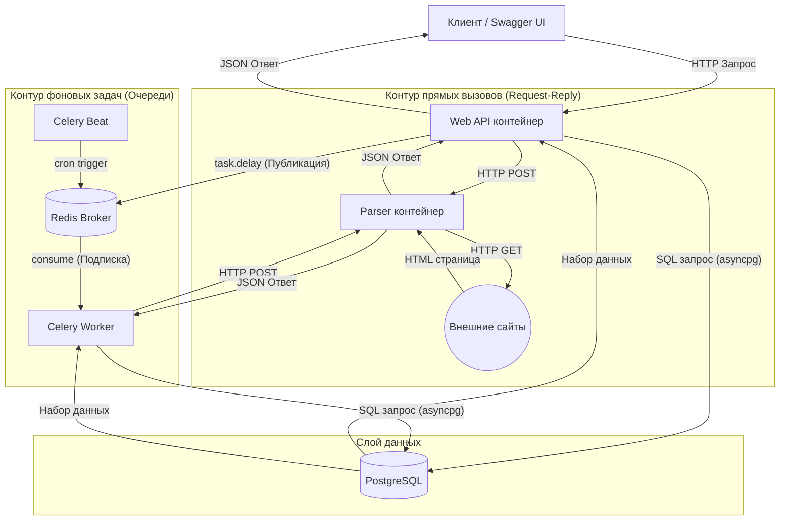

# Отчет по лабораторной работе №3: "Упаковка FastAPI приложения в Docker, Работа с источниками данных и Очереди"

**Дисциплина:** Web-программирование

**Тема проекта:** Веб-приложение для буккроссинга (Bookcrossing)

**Студент:** Христофоров Владислав Николаевич, WEB 2.1

## 1. Введение

В рамках данной лабораторной работы осуществлено объединение основного REST API и алгоритмов извлечения данных в единую инфраструктуру. Программные компоненты системы были изолированы друг от друга с использованием технологий контейнеризации (Docker), а для связи между ними настроено сетевое взаимодействие.

**Цель работы:** интегрировать парсер данных в основное веб-приложение, реализовать возможность вызова парсера как синхронно (через REST API), так и асинхронно (с использованием брокера сообщений и фоновых очередей задач), а также оркестрировать запуск всей инфраструктуры в виртуальной сети.

### Основные решаемые задачи:

1. Оформление скриптов парсинга в виде полноценного независимого веб-сервиса на FastAPI.
2. Реализация синхронного межсервисного взаимодействия по протоколу HTTP (REST).
3. Выделение логики HTTP-запросов и сохранения спарсенных данных в отдельные вспомогательные функции для предотвращения дублирования кода.
4. Развертывание брокера сообщений (Redis) и распределенной очереди задач (Celery) для фоновой обработки сетевых запросов.
5. Настройка планировщика периодических системных задач (Celery Beat).
6. Контейнеризация и оркестрация всей инфраструктуры средствами Docker Compose с использованием healthcheck-проверок.

## 2. Топология сервисов и стек технологий

В целевой архитектуре система состоит из 6 изолированных контейнеров, общающихся внутри единой приватной сети Docker.



### 2.1. Стек технологий инфраструктуры

| Компонент                      | Технология            | Роль и назначение в архитектуре                                                                                |
| :----------------------------- | :-------------------- | :------------------------------------------------------------------------------------------------------------- |
| **Основное API (`web`)**       | FastAPI, Python 3.12  | Обработка клиентских запросов, маршрутизация, управление бизнес-логикой и JWT-авторизацией.                    |
| **Служба парсинга (`parser`)** | FastAPI, aiohttp, bs4 | Обертка над скриптами для извлечения метаданных из HTML-ресурсов (Project Gutenberg, Standard Ebooks).         |
| **База данных (`db`)**         | PostgreSQL 16         | Персистентное хранение реляционных данных системы.                                                             |
| **Брокер сообщений (`redis`)** | Redis                 | In-memory хранилище (Message Broker) для маршрутизации задач Celery и сохранения их статусов (Result Backend). |
| **Исполнитель (`worker`)**     | Celery                | Фоновый рабочий процесс (consumer), выполняющий задачи парсинга в обход основного Event Loop FastAPI.          |
| **Планировщик (`beat`)**       | Celery Beat           | Служба-планировщик для инициации системных задач по расписанию (аналог Cron).                                  |

## 3. Синхронное взаимодействие

Для интеграции парсера в главное приложение логика отправки HTTP-запроса через библиотеку `httpx` и алгоритмы сохранения данных в БД (с созданием и привязкой жанров в `save_parsed_book`) были вынесены во вспомогательный модуль `services/parser_service.py`.

**Синхронный эндпоинт (`POST /parser/sync`)** работает по классической модели: он блокирует контекст текущего HTTP-запроса, переиспользует вспомогательную функцию для ожидания ответа от контейнера `parser`, сохраняет данные в локальную БД и лишь затем возвращает ответ клиенту.

```python
# Фрагмент роутера (routers/parser.py)
@router.post("/sync", response_model=BookPublicWithGenres)
async def parse_and_save_sync(
    request: ParseRequestURL,
    session: AsyncSession = Depends(get_session),
    current_user: User = Depends(get_current_user)
):
    parser_data = await fetch_data_from_microservice(request.url)
    new_book = await save_parsed_book(session, parser_data, current_user.id)
    return new_book
```

## 4. Асинхронные очереди и планировщик (Celery + Redis)

Для предотвращения блокировки основного веб-сервера при длительном парсинге книг внедрена распределенная система очередей задач.

### 4.1. Роутинг асинхронных задач (API)

При вызове эндпоинта `POST /parser/async` приложение использует метод `task.delay()`. Это сериализует аргументы функции и мгновенно отправляет их в брокер Redis. Клиент получает `task_id` и ответ со статусом `Task added to queue`, не дожидаясь реального окончания парсинга. Для мониторинга прогресса (Polling) реализован эндпоинт `GET /parser/status/{task_id}`.

```python
# Фрагмент роутера (routers/parser.py)
@router.post("/async", response_model=TaskResponse)
async def parse_and_save_async(
    request: ParseRequestURL,
    current_user: User = Depends(get_current_user)
):
    task = parse_and_save_task.delay(request.url, current_user.id)
    return {"task_id": task.id, "status": "Task added to queue"}

@router.get("/status/{task_id}")
async def get_task_status(task_id: str):
    task_result = AsyncResult(task_id, app=celery_app)
    response = {
        "task_id": task_id,
        "status": task_result.status,
    }
    if task_result.ready():
        response["result"] = task_result.result
    return response
```

### 4.2. Изоляция пула соединений СУБД (Решение конфликтов Event Loop)

Ключевой сложностью при интеграции синхронных воркеров Celery с асинхронным драйвером базы данных `asyncpg` является жесткая привязка пула сетевых TCP-соединений к конкретному циклу событий (Event Loop). При попытке импорта глобального объекта `engine` из основного приложения возникали критические ошибки конкурентного доступа (`another operation is in progress`).

**Архитектурное решение:** внутри функции задачи (в модуле `tasks.py`) реализовано локальное создание изолированного пула подключений `create_async_engine` с использованием `AsyncSession` из библиотеки SQLModel. Этот пул инициализируется и уничтожается (`engine.dispose()`) строго в пределах локального `asyncio.run()`, изолируя соединения от других задач и процессов.

```python
# Фрагмент фоновой задачи (tasks.py)
@shared_task(name="tasks.parse_and_save_task")
def parse_and_save_task(url: str, user_id: int) -> dict:
    from services.parser_service import fetch_data_from_microservice, save_parsed_book

    async def run_async_pipeline() -> dict:
        # Инициализация изолированного пула во избежание конфликтов Event Loop
        engine = create_async_engine(settings.DATABASE_URL)
        session_factory = async_sessionmaker(engine, class_=AsyncSession, expire_on_commit=False)

        try:
            async with session_factory() as session:
                data = await fetch_data_from_microservice(url)
                book = await save_parsed_book(session, data, user_id)
                return {"status": "Success", "title": book.title, "bcid": book.bcid}
        except HTTPException as e:
            return {"status": "Failed", "error": str(e.detail)}
        except Exception as e:
            return {"status": "Error", "error": str(e)}
        finally:
            await engine.dispose() # Корректное освобождение ресурсов сокетов

    return asyncio.run(run_async_pipeline())
```

### 4.3. Системные задачи по расписанию (Celery Beat)

Для автоматизации фоновых процессов настроен планировщик `Celery Beat`. В проекте реализована задача `log_database_statistics`, которая по заданному расписанию (каждую минуту в рамках демонстрации) осуществляет агрегацию данных – подсчет общего количества книг в библиотеке – и выводит системный отчет в лог-файл воркера.

```python
# Фрагмент фоновой задачи (tasks.py)
@shared_task(name="tasks.log_database_statistics")
def log_database_statistics():
    async def run_stats_check():
        engine = create_async_engine(settings.DATABASE_URL)
        session_factory = async_sessionmaker(engine, class_=AsyncSession, expire_on_commit=False)
        try:
            async with session_factory() as session:
                from sqlmodel import select, func
                from models.books import Book

                result = await session.exec(select(func.count(Book.id)))
                total_books = result.one()
                print(f"[CELERY BEAT] Системная аналитика: Зарегистрировано {total_books} сущностей 'Книга'.")
        finally:
            await engine.dispose()

    asyncio.run(run_stats_check())
```

## 5. Инструкция по локальному развертыванию

Процесс развертывания автоматизирован средствами Docker Compose. В конфигурации внедрены проверки состояния (Healthchecks), гарантирующие, что зависимые сервисы (веб-приложение и воркеры) запускаются исключительно после полной готовности базы данных принимать соединения.

Для локального запуска выполните следующие шаги:

1. **Клонирование проекта:**

    ```bash
    git clone [https://github.com/](https://github.com/)[ЛОГИН]/[РЕПОЗИТОРИЙ].git
    cd Lr3
    ```

2. **Настройка переменных окружения:**
   В директории `Lr3/web/` создайте файл `.env`. Обратите внимание, что URL-адреса брокера сообщений (Redis) и хост БД передаются безопасно напрямую в `docker-compose.yml` и не запекаются внутрь образов. В `.env` достаточно указать ключи шифрования:

    ```env
    # Lr3/web/.env
    SECRET_KEY=super-secret-key-for-bookcrossing-lab3
    ALGORITHM=HS256
    ACCESS_TOKEN_EXPIRE_MINUTES=30
    ```

3. **Сборка и запуск оркестратора:**
   Выполните команду для сборки образов и фонового запуска всей системы:

    ```bash
    docker-compose up -d --build
    ```

4. **Автоматические миграции и проверка:**
   Команда запуска веб-сервера `web` в `docker-compose.yml` автоматически выполняет `alembic upgrade head` перед стартом сервера. Ручной накат миграций не требуется.

    Убедитесь, что все контейнеры запущены успешно:

    ```bash
    docker-compose ps
    ```

5. **Доступ к сервисам:**
    - **Главное API (Bookcrossing):** `http://localhost:8000/docs`
    - **API Сервиса парсера:** `http://localhost:8001/docs`

6. **Остановка и очистка:**
   Для полной остановки системы с удалением томов базы данных (Сброс стейта):
    ```bash
    docker-compose down -v
    ```

## 6. Заключение

В ходе выполнения лабораторной работы разрозненные компоненты из предыдущих работ (REST API и скрипты парсинга) были успешно объединены в единую контейнеризованную систему. Внедрение Docker стандартизировало процесс сборки и развертывания проекта, устранив возможные конфликты зависимостей локальных сред. Интеграция Celery и Redis позволила перенести длительные сетевые вызовы в фоновые процессы, обеспечив неблокирующий отклик основного веб-сервера (FastAPI). Вынесение вспомогательной логики работы с БД и HTTP-запросами в отдельные функции исключило дублирование кода между синхронными маршрутами и фоновыми задачами.
